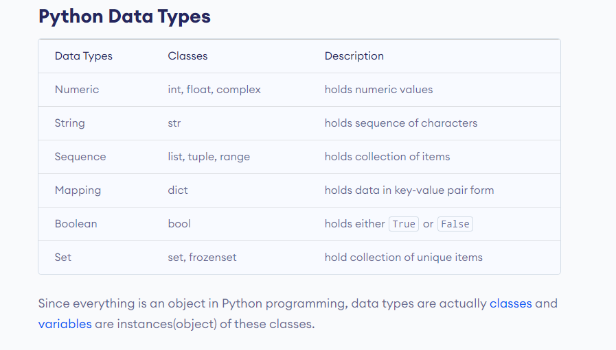

Datatypes in Python
===================

Python supports various data types that define the kind of value a variable can hold. Understanding data types is fundamental in Python programming, as they help you work with different kinds of data in a meaningful way.

.. note::
   Python is dynamically typed, which means you don't need to declare the type of a variable when you create one. The type is inferred at runtime.

Built-in Data Types
-------------------

### Numeric Types

1. **int**: Integer numbers, e.g., `1`, `-5`, `42`
2. **float**: Floating-point numbers (decimal numbers), e.g., `3.14`, `-0.001`, `2.0`
3. **complex**: Complex numbers, e.g., `1 + 2j`, `3 - 4j`

.. warning::
   Division by zero will raise a `ZeroDivisionError`.

#### Examples

.. code-block:: python

    x = 5       # int
    y = 3.14    # float
    z = 1 + 2j  # complex

### Sequence Types

1. **str**: Strings, sequences of characters, e.g., `"hello"`, `'world'`
2. **list**: Lists, ordered collections of items, e.g., `[1, 2, 3]`, `['a', 'b', 'c']`
3. **tuple**: Tuples, ordered collections of items (immutable), e.g., `(1, 2, 3)`, `('a', 'b', 'c')`
4. **range**: Ranges, sequences of numbers, e.g., `range(5)`

.. note::
   Strings in Python are immutable, which means they cannot be changed after they are created.

#### Examples

.. code-block:: python

    s = "hello"          # str
    l = [1, 2, 3]        # list
    t = (1, 2, 3)        # tuple
    r = range(5)         # range

### Mapping Type

1. **dict**: Dictionaries, collections of key-value pairs, e.g., `{'name': 'John', 'age': 30}`

.. warning::
   Dictionary keys must be immutable and hashable types such as strings, numbers, or tuples.

#### Example

.. code-block:: python

    d = {'name': 'John', 'age': 30}  # dict

### Set Types

1. **set**: Sets, unordered collections of unique items, e.g., `{1, 2, 3}`
2. **frozenset**: Frozensets, immutable sets, e.g., `frozenset([1, 2, 3])`

#### Examples

.. code-block:: python

    s = {1, 2, 3}                  # set
    fs = frozenset([1, 2, 3])      # frozenset

.. note::
   Sets are optimized for membership testing (checking if an item is in the set).

### Boolean Type

1. **bool**: Boolean values, `True` or `False`

.. note::
   Boolean values in Python are actually a subtype of integers. `True` is equivalent to `1` and `False` is equivalent to `0`.

#### Example

.. code-block:: python

    b = True   # bool

### None Type

1. **NoneType**: Represents the absence of a value, `None`

.. note::
   `None` is often used as a default value for function parameters or to signify the end of a list in linked list implementations.

#### Example

.. code-block:: python

    n = None   # NoneType

Type Conversion
---------------

You can convert between different data types using built-in functions:

- `int()`: Convert to integer
- `float()`: Convert to floating-point number
- `str()`: Convert to string
- `list()`: Convert to list
- `tuple()`: Convert to tuple
- `set()`: Convert to set
- `dict()`: Convert to dictionary
- `bool()`: Convert to boolean

.. warning::
   Converting between incompatible types will raise a `ValueError`.

#### Examples

.. code-block:: python

    x = int("42")         # str to int
    y = float("3.14")     # str to float
    z = str(42)           # int to str
    l = list((1, 2, 3))   # tuple to list
    t = tuple([1, 2, 3])  # list to tuple
    s = set([1, 2, 3])    # list to set
    b = bool(1)           # int to bool

Checking the Data Type
----------------------

You can check the data type of a variable using the `type()` function:

#### Example

.. code-block:: python

    x = 42
    print(type(x))  # Output: <class 'int'>

Program Example
---------------

Here's a complete program that demonstrates different data types in Python:

.. code-block:: python

    # Numeric types
    int_var = 42
    float_var = 3.14
    complex_var = 1 + 2j

    # Sequence types
    str_var = "hello"
    list_var = [1, 2, 3]
    tuple_var = (1, 2, 3)
    range_var = range(5)

    # Mapping type
    dict_var = {'name': 'John', 'age': 30}

    # Set types
    set_var = {1, 2, 3}
    frozenset_var = frozenset([1, 2, 3])

    # Boolean type
    bool_var = True

    # None type
    none_var = None

    # Print the variables and their types
    print("int_var:", int_var, "type:", type(int_var))
    print("float_var:", float_var, "type:", type(float_var))
    print("complex_var:", complex_var, "type:", type(complex_var))
    print("str_var:", str_var, "type:", type(str_var))
    print("list_var:", list_var, "type:", type(list_var))
    print("tuple_var:", tuple_var, "type:", type(tuple_var))
    print("range_var:", list(range_var), "type:", type(range_var))  # Convert range to list for printing
    print("dict_var:", dict_var, "type:", type(dict_var))
    print("set_var:", set_var, "type:", type(set_var))
    print("frozenset_var:", frozenset_var, "type:", type(frozenset_var))
    print("bool_var:", bool_var, "type:", type(bool_var))
    print("none_var:", none_var, "type:", type(none_var))

Output
------

.. code-block:: text

    int_var: 42 type: <class 'int'>
    float_var: 3.14 type: <class 'float'>
    complex_var: (1+2j) type: <class 'complex'>
    str_var: hello type: <class 'str'>
    list_var: [1, 2, 3] type: <class 'list'>
    tuple_var: (1, 2, 3) type: <class 'tuple'>
    range_var: [0, 1, 2, 3, 4] type: <class 'range'>
    dict_var: {'name': 'John', 'age': 30} type: <class 'dict'>
    set_var: {1, 2, 3} type: <class 'set'>
    frozenset_var: frozenset({1, 2, 3}) type: <class 'frozenset'>
    bool_var: True type: <class 'bool'>
    none_var: None type: <class 'NoneType'>

Summary
-------

Understanding data types in Python is crucial for writing effective and efficient code. Each data type serves a specific purpose and offers different functionalities. By knowing when and how to use these data types, you can handle various kinds of data with ease.